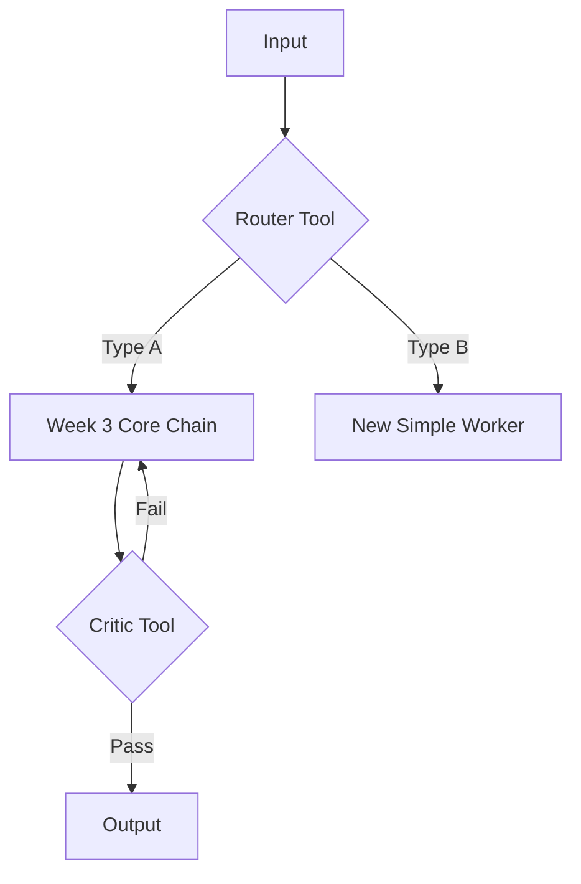

# Process Design Document (PDD) - Working Draft
**Team Name:**
**Project Title:**
**Current Phase:** Week 4 (Advanced Logic Design)

> *This version assumes you already completed the week 2 and week 3 portions. Copy them in the respective sections.*
---

## [Part 1: Process Analysis]
*(Retain your Week 2 content: As-Is Map, Business Case, etc.)*

---

## [Part 2: The Core Capability (The Linear Worker)]
*(Retain your Week 3 content. This Linear Chain (Gatekeeper -> Judge -> Worker) will likely become one of the "Branches" in your new system.)*

---

## Part 3: The Intelligent Network (Week 4 Additions)

*In Week 4, we wrap the Linear Core in advanced logic to handle variety (Routing) and quality (Looping).*

### 3.1 The Architecture Strategy
*Which Advanced Patterns are you deploying to fix the "Real World Complexity"? Check at least one.*
*   [ ] **The Router (Branching):** To handle different types of inputs (e.g., separating Spam from Valid Requests).
*   [ ] **The Evaluator-Optimizer (Looping):** To ensure quality/safety (e.g., checking the Draft before sending).
*   [ ] **The Orchestrator-Workers (Parallel):** To handle complex, multi-step research.

### 3.2 The Advanced Logic Map (Mermaid)
*(Update your diagram. It should now contain Diamonds (Decisions) or Circles (Loops) wrapping around your nodes.)*

### 3.3 The Orchestrator Logic
*Define the step-by-step execution plan (The "Operating System"). This replaces the simple "1-2-3" sequence.*

> **Example Logic:**
> 1.  **Ingest** user input.
> 2.  **Call** `Intent_Router` tool.
> 3.  **IF** output is "REFUND" (Type A):
>     *   Run Week 3 Core Chain (Gatekeeper -> Judge -> Draft).
>     *   **Loop:** Pass Draft to `Critic_Tool`.
>     *   If `Critic` says FAIL, rewrite draft. Repeat until PASS.
> 4.  **IF** output is "SPAM" (Type B):
>     *   Terminate.
> 5.  **Output** final result.

---

### 3.4 New Component Definitions (The Modules)

---

#### **[Module A: The Parallel Worker Configuration]**
*(Used to implement the Orchestrator-Workers (Parallel) pattern.)*

*   **Tool Name:** Multi-Draft Parallel Worker
*   **Input Variables:** `{{extracted_json}}`, `{{judge_report}}`
*   **Output Categories:**
    1. DRAFT_A_ENTHUSIASM
    2. DRAFT_B_PERSONALITY
    3. DRAFT_C_FIT
*   **R.A.F.T. Prompt Draft:**
    > **ROLE:** You are the Multi-Draft Parallel Worker in a hardened AI-assisted cover letter workflow.  
    >  
    > **TASK:**  
    > Consume `extracted_json` (facts) and `judge_report` (strategy) and generate THREE distinct, fully grounded cover letter drafts:
    > - Draft A — Enthusiasm Mode  
    > - Draft B — Personality Mode  
    > - Draft C — Fit Mode  
    >  
    > **HARD RULES:**  
    > - Do NOT invent facts.  
    > - Do NOT inflate mastery or upgrade experience.  
    > - Every factual claim must trace to `extracted_json` or `judge_report.safe_claims`.  
    > - If gaps exist, incorporate `judge_report.narrative_pivots`.  
    > - All three drafts must differ meaningfully in opening, emphasis, and structure.  
    >  
    > **OUTPUT:**  
    > Return valid JSON only:
    > {
    >   "drafts": {
    >     "draft_A_enthusiasm": {"cover_letter":"", "evidence_used":[], "gaps_handled":[]},
    >     "draft_B_personality": {"cover_letter":"", "evidence_used":[], "gaps_handled":[]},
    >     "draft_C_fit": {"cover_letter":"", "evidence_used":[], "gaps_handled":[]}
    >   }
    > }

---

#### **[Module B: The Evaluator Configuration — Gatekeeper Loop]**
*(Implements Evaluator-Optimizer (Looping) for structural compliance.)*

*   **Tool Name:** Gatekeeper Critic — Structural Audit
*   **Input Variable:** `{{extracted_json}}`
*   **Evaluation Rubric:**
    *   *Rule 1:* Structured arrays must originate from explicitly labeled headers (Tool 5 label-like exception allowed).
    *   *Rule 2:* No paraphrasing, inference, or narrative promotion into structured fields.
    *   *Rule 3:* alignment_candidates must pair verbatim job requirement text with verbatim resume excerpts.
    *   *Rule 4:* No semantic stitching across sections, sentences, or documents.
    *   *Rule 5:* Enumerated voice_profile fields must match allowed values.
*   **R.A.F.T. Prompt Draft:**
    > **ROLE:** You are the Gatekeeper Critic.  
    >  
    > **TASK:** Audit `extracted_json` for structural and grounding compliance.  
    >  
    > **OUTPUT:** Return JSON only:
    > {
    >   "gatekeeper_status": "PASS | FAIL | TERMINAL_FAIL",
    >   "workflow_status": "CONTINUE | RETRY | FAILED_AFTER_MAX_RETRIES",
    >   "violations": [{"field":"","violation_type":"","explanation":""}]
    > }
    >  
    > If FAIL and retry_count < 3 → workflow_status = RETRY.  
    > If FAIL and retry_count ≥ 3 → TERMINAL_FAIL.

---

#### **[Module C: The Evaluator Configuration — Judge Loop]**
*(Implements Evaluator-Optimizer (Looping) for logical and anti-inflation compliance.)*

*   **Tool Name:** Judge Critic — Logic & Anti-Inflation Audit
*   **Input Variable:** `{{judge_xml}}`, `{{extracted_json}}`
*   **Evaluation Rubric:**
    *   *Rule 1:* No inflated requirement language (e.g., mastery, expert, advanced) unless explicitly supported in `extracted_json`.
    *   *Rule 2:* Job requirement wording may not be converted into candidate qualification claims.
    *   *Rule 3:* Internship or simulation experience cannot be upgraded to production ownership.
    *   *Rule 4:* All unsupported job requirements must appear in `<critical_gaps>` with corresponding pivots.
    *   *Rule 5:* All strategic leverage points must trace directly to structured JSON inputs.
    *   *Rule 6:* tone_direction must derive from voice_profile, tone_of_company, or company_personalization.
*   **R.A.F.T. Prompt Draft:**
    > **ROLE:** You are the Judge Critic enforcing logical integrity and anti-inflation compliance.  
    >  
    > **TASK:** Validate `judge_xml` against `extracted_json`.  
    >  
    > **OUTPUT:** Return JSON only:
    > {
    >   "judge_status": "PASS | FAIL | TERMINAL_FAIL",
    >   "workflow_status": "CONTINUE | RETRY | FAILED_AFTER_MAX_RETRIES",
    >   "violations": [{"section":"","violation_type":"","explanation":""}]
    > }
    >  
    > If FAIL and retry_count < 3 → workflow_status = RETRY.  
    > If FAIL and retry_count ≥ 3 → TERMINAL_FAIL.

---

### 3.5 Advanced Simulation Log (Proof of Robustness)
*Provide a chat log showing the Logic handling a complex case.*

**Scenario: The Edge Case**
*   **Input:** (e.g., A Spam message OR a Bad Draft that triggers the Critic)
*   **Trace:**
    *   *Router Output:* ...
    *   *Branch Taken:* ...
    *   *Critic Verdict:* ...
    *   *Final Result:* ...
